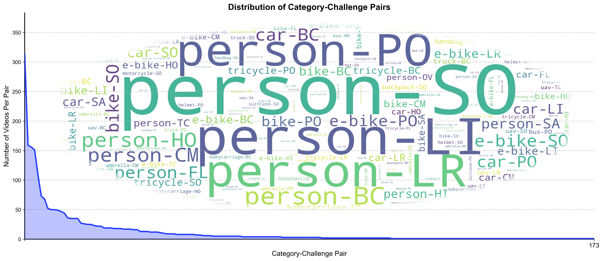

# DRGBT-1K: Toward a Large-scale and High-quality Benchmark for DRGBT Tracking

[](https://YOUR_DOMAIN.com/YOUR_PROJECT_PAGE)
[](https://arxiv.org/abs/<ARXIV_PAPER_ID>)
[](#5-dataset-download)

Official repository for the paper:

**[Toward a Large-scale and High-quality Benchmark for DRGBT Tracking](https://arxiv.org/abs/<ARXIV_PAPER_ID>)**

---

## 1. Motivation

RGBT tracking receives a surge of interest in the computer vision community, but existing RGBT benchmarks assume a single, fixed observation platform with synchronized RGB and thermal sensors. In real-world collaborative perception systems, however, the target is often observed by **multiple heterogeneous platforms** (e.g., UAVs and ground cameras) that carry different sensors and may hand off tracking responsibility over time. This leads to **Dynamic RGBT (DRGBT) tracking**, where both the available modalities and observation viewpoints change dynamically.

The existing DRGBT dataset (DRGBT603) is limited in scale and contains many synthetically constructed cross-platform sequences. To address these limitations, we present **DRGBT-1K** — the first large-scale, fully real-captured DRGBT tracking benchmark.

<p align="center">
  
</p>

---

## 2. About DRGBT-1K Benchmark

### Highlights

* **Fully Real-Captured**: All 1,045 sequences are captured from real-world scenarios using real cross-platform handoffs, avoiding synthetic construction.
* **Large Scale**: Contains **1,045 real sequences** and **795K frame pairs** in total (**2,090** RGBT sequences considering multi-view perspectives).
* **High-Quality Annotations**: Contains over **799K** densely annotated target bounding boxes across multi-view sequences.
* **Multi-Platform Imaging Devices**: Data collected using **DJI Mavic 3T** (UAV) and **Hikvision RGBT Camera** (handheld/ground), preserving genuine viewpoint discontinuities.
* **Rich Scenes and Categories**: Covers **24 target categories** across diverse scenarios (daytime, nighttime, highways, parks, campuses, etc.).
* **Real-World Challenges**: Annotated with **15 challenge attributes** reflecting practical DRGBT tracking difficulties.

### Data Samples

Below are representative samples from DRGBT-1K, showcasing various scenes, categories, and cross-platform viewpoints (RGB and thermal pairs from both UAV and ground perspectives):

<p align="center">
  
</p>

---

## 3. Dataset Statistics

### Comparison with Existing Benchmarks

| Dataset | Pub. Info | Task Type | View Num. | Sequence Num. | Total Frames | Object Classes | Attr. | Dynamic Modality | Cross Platform | Real Cross-platform Seq. Num. |
| :--- | :---: | :---: | :---: | :---: | :---: | :---: | :---: | :---: | :---: | :---: |
| **GTOT** | TIP 2017 | RGBT | 1 | 50 | 7.8K | 9 | 7 | ✕ | ✕ | 0 |
| **RGBT210** | CVPR 2018 | RGBT | 1 | 210 | 104.7K | 22 | 12 | ✕ | ✕ | 0 |
| **RGBT234** | TPAMI 2019 | RGBT | 1 | 234 | 116.7K | 22 | 12 | ✕ | ✕ | 0 |
| **LasHeR** | TIP 2021 | RGBT | 1 | 1224 | 734.8K | 32 | 19 | ✕ | ✕ | 0 |
| **VTUAV** | CVPR 2022 | RGBT | 1 | 500 | 1.7M | 13 | 13 | ✕ | ✕ | 0 |
| **DRGBT603** | TIP 2026 | DRGBT | 2 | 603 | 1.49M | 29 | 12 | ✓ | ✓ | 203 |
| **DRGBT-1K (Ours)** | — | DRGBT | 2 | **1045 (2090)†** | **795K** | **24** | **15** | **✓** | **✓** | **1045** |

†indicates that DRGBT contains 2,090 RGBT tracking sequences in total.

### Distribution Statistics

The following figure shows: (a) Category distribution across daytime and nighttime scenarios, (b) Distribution of modalities and platforms, and (c) Distribution of challenge attributes with train/test splits.

<p align="center">
  
</p>

<p align="center">
  
</p>

### 15 Challenge Attributes

DRGBT-1K annotates each sequence with 15 challenge attributes reflecting real-world tracking scenarios:

| Attr | Full Name | Description |
| :---: | :--- | :--- |
| **HO** | Heavy Occlusion | The target is severely occluded. |
| **PO** | Partial Occlusion | The target is slightly or partially occluded. |
| **LI** | Low Illumination | The sequence is captured under low-light conditions (e.g., nighttime). |
| **LR** | Low Resolution | The target region is blurred or has low visual resolution. |
| **BC** | Background Clutter | The background is complex and contains many interfering objects. |
| **HI** | High Illumination | Strong illumination or glare appears in the scene. |
| **SA** | Similar Appearance | Similar objects appear near the target, making it hard to distinguish. |
| **FL** | Frame Lost | Several consecutive frames are completely identical. |
| **SO** | Small Object | The target is very small in the image. |
| **FM** | Fast Motion | The target moves rapidly between adjacent frames. |
| **OV** | Out-of-View | The target leaves the camera field of view and later reappears. |
| **SV** | Scale Variation | The target undergoes significant scale changes. |
| **CM** | Camera Moving | The camera has obvious motion or shake. |
| **TC** | Thermal Crossover | Target and background have similar temperatures (low thermal contrast). |
| **ARC** | Aspect Ratio Change | The aspect ratio of the bounding box is outside the range [0.5, 2]. |

---

## 4. Train/Test Split

We split DRGBT-1K into **training** and **testing** subsets according to the target category distribution, ensuring balanced representation across all 24 classes:

| Split | Sequences | Usage |
| :---: | :---: | :--- |
| Training | 800 | For training deep DRGBT trackers |
| Testing | 245 | For benchmarking and evaluation |
| **Total** | **1045** | — |

The training and testing sets maintain similar distributions in terms of target categories, challenge attributes, and day/night ratios.

---

## 5. Dataset Download

* **DRGBT-1K (Aligned)**: [BaiduNetdisk](https://pan.baidu.com/)（Password: xxxx）| [Google Drive](https://drive.google.com/) | [Hugging Face](https://huggingface.co/)
* **DRGBT-1K (Unaligned)**: [BaiduNetdisk](https://pan.baidu.com/)（Password: xxxx）| [Google Drive](https://drive.google.com/) | [Hugging Face](https://huggingface.co/)
  > *Note: Due to the physical structure of heterogeneous devices and sensor mechanisms, real-world data naturally exhibits modality offsets between RGB and TIR under different viewpoints. We provide this unaligned version to facilitate research on spatial perturbation and cross-modality alignment.*
* **UGVT1K**: [BaiduNetdisk](https://pan.baidu.com/)（Password: xxxx）| [Google Drive](https://drive.google.com/) | [Hugging Face](https://huggingface.co/)
* **Evaluation Toolkit**: [BaiduNetdisk](https://pan.baidu.com/)（Password: xxxx）| [Google Drive](https://drive.google.com/)

---

## 6. Dataset File Structure

```
sequence_name/
├── ground_viewq/
│   ├── RGB/
│   │   ├── 000001.jpg
│   │   └── ...
│   ├── TIR/
│   │   ├── 000001.jpg
│   │   └── ...
│   └── init.txt
├── uav_viewq/
│   ├── RGB/
│   │   ├── 000001.jpg
│   │   └── ...
│   ├── TIR/
│   │   ├── 000001.jpg
│   │   └── ...
│   └── init.txt
├── challenges.txt
├── init_frame.txt
├── modality.txt
├── platforms.txt
├── scene_class.txt
├── target_class.txt
└── valid_frames.txt
```

---

## 7. Benchmark Results

### Evaluation on DRGBT-1K

We evaluate multiple categories of tracking methods on DRGBT-1K, including RGBT trackers, multi-modal trackers, and DRGBT trackers, under the **One-Pass Evaluation (OPE)** protocol. The primary evaluation metrics are:
* **Precision Rate (PR)**: Percentage of frames whose center location error is within 20 pixels.
* **Normalized Precision Rate (NPR)**: Center location error normalized by target size.
* **Success Rate (SR)**: Bounding box overlap (IoU) evaluated using Area Under Curve (AUC).

### Overall Performance on DRGBT-1K (OPE Protocol)

Below are the baseline results of representative state-of-the-art trackers evaluated on the DRGBT-1K test set:

<table>
  <thead>
    <tr>
      <th align="left">Method</th>
      <th align="center">Source</th>
      <th align="center">PR (%)</th>
      <th align="center">NPR (%)</th>
      <th align="center">SR (%)</th>
    </tr>
  </thead>
  <tbody>
    <tr>
      <td colspan="5" align="center"><b><i>RGBT Trackers</i></b></td>
    </tr>
    <tr>
      <td><b>OSTrack</b></td>
      <td align="center">ECCV'22</td>
      <td align="center">47.39</td>
      <td align="center">41.47</td>
      <td align="center">34.46</td>
    </tr>
    <tr>
      <td><b>TBSI</b></td>
      <td align="center">CVPR'23</td>
      <td align="center">43.89</td>
      <td align="center">38.81</td>
      <td align="center">32.34</td>
    </tr>
    <tr>
      <td><b>TATrack</b></td>
      <td align="center">AAAI'24</td>
      <td align="center">47.82</td>
      <td align="center">41.17</td>
      <td align="center">34.40</td>
    </tr>
    <tr>
      <td><b>BAT</b></td>
      <td align="center">AAAI'24</td>
      <td align="center">45.84</td>
      <td align="center">41.08</td>
      <td align="center">33.86</td>
    </tr>
    <tr>
      <td><b>PURA</b></td>
      <td align="center">CVPR'24</td>
      <td align="center">48.32</td>
      <td align="center">40.73</td>
      <td align="center">33.98</td>
    </tr>
    <tr>
      <td><b>SDSTrack</b></td>
      <td align="center">CVPR'24</td>
      <td align="center">40.66</td>
      <td align="center">33.64</td>
      <td align="center">28.23</td>
    </tr>
    <tr>
      <td><b>MMLoRAT</b></td>
      <td align="center">ECCV'24</td>
      <td align="center">47.76</td>
      <td align="center"><b><font color="blue">43.06</font></b></td>
      <td align="center">34.92</td>
    </tr>
    <tr>
      <td><b>CKD</b></td>
      <td align="center">ACM MM'24</td>
      <td align="center">45.67</td>
      <td align="center">40.97</td>
      <td align="center">33.75</td>
    </tr>
    <tr>
      <td><b>AINet</b></td>
      <td align="center">AAAI'25</td>
      <td align="center">44.83</td>
      <td align="center">40.42</td>
      <td align="center">33.14</td>
    </tr>
    <tr>
      <td><b>STTrack</b></td>
      <td align="center">AAAI'25</td>
      <td align="center">22.57</td>
      <td align="center">17.38</td>
      <td align="center">16.61</td>
    </tr>
    <tr>
      <td><b>CAFormer</b></td>
      <td align="center">AAAI'25</td>
      <td align="center">46.06</td>
      <td align="center">39.80</td>
      <td align="center">33.51</td>
    </tr>
    <tr>
      <td><b>FMTrack</b></td>
      <td align="center">TCSVT'25</td>
      <td align="center"><b><font color="blue">48.64</font></b></td>
      <td align="center">41.58</td>
      <td align="center">34.91</td>
    </tr>
    <tr>
      <td><b>QSTNet</b></td>
      <td align="center">TIP'25</td>
      <td align="center">44.21</td>
      <td align="center">39.20</td>
      <td align="center">32.27</td>
    </tr>
    <tr>
      <td><b>MRTTrack</b></td>
      <td align="center">PR'25</td>
      <td align="center">43.72</td>
      <td align="center">38.76</td>
      <td align="center">32.04</td>
    </tr>
    <tr>
      <td><b>UATrack</b></td>
      <td align="center">IJCV'26</td>
      <td align="center">46.92</td>
      <td align="center">40.77</td>
      <td align="center">34.02</td>
    </tr>
    <tr>
      <td><b>GOLA</b></td>
      <td align="center">CVPR'26</td>
      <td align="center"><b><font color="red">51.18</font></b></td>
      <td align="center"><b><font color="red">46.42</font></b></td>
      <td align="center"><b><font color="red">38.01</font></b></td>
    </tr>
    <tr>
      <td colspan="5" align="center"><b><i>MMRGBT Trackers</i></b></td>
    </tr>
    <tr>
      <td><b>IPT</b></td>
      <td align="center">IJCV'25</td>
      <td align="center">46.52</td>
      <td align="center">39.89</td>
      <td align="center">33.46</td>
    </tr>
    <tr>
      <td><b>TMKD</b></td>
      <td align="center">PR'26</td>
      <td align="center">48.06</td>
      <td align="center">42.95</td>
      <td align="center"><b><font color="blue">35.52</font></b></td>
    </tr>
    <tr>
      <td><b>SCDT</b></td>
      <td align="center">CVPR'26</td>
      <td align="center">45.57</td>
      <td align="center">36.41</td>
      <td align="center">29.91</td>
    </tr>
    <tr>
      <td colspan="5" align="center"><b><i>DRGBT Trackers</i></b></td>
    </tr>
    <tr>
      <td><b>CMRL</b></td>
      <td align="center">TIP'26</td>
      <td align="center">43.03</td>
      <td align="center">38.48</td>
      <td align="center">31.82</td>
    </tr>
  </tbody>
</table>


### Qualitative Results

<p align="center">
  
</p>

---

## 8. UGVT1K: UAV-Ground Collaborative Visual Tracking Benchmark

As a derivative of DRGBT-1K, we also release **UGVT1K** — a UAV-Ground collaborative RGB-only tracking benchmark. UGVT1K contains the same cross-platform sequences but uses only the visible (RGB) modality, enabling research on multi-view visual tracking without thermal data.

<p align="center">
  
</p>

---

## 9. Citation

If you find our benchmark, toolkit, or paper helpful in your research, please cite us:

```bibtex
@article{DRGBT-1K2026,
  title={Toward a Large-scale and High-quality Benchmark for DRGBT Tracking},
  author={First Author and Second Author and Third Author},
  journal={arXiv preprint arXiv:xxxx.xxxx},
  year={2026}
}
```

---

## License

This dataset is released under the [Creative Commons Attribution-ShareAlike 4.0 International License (CC BY-SA 4.0)](https://creativecommons.org/licenses/by-sa/4.0/).
