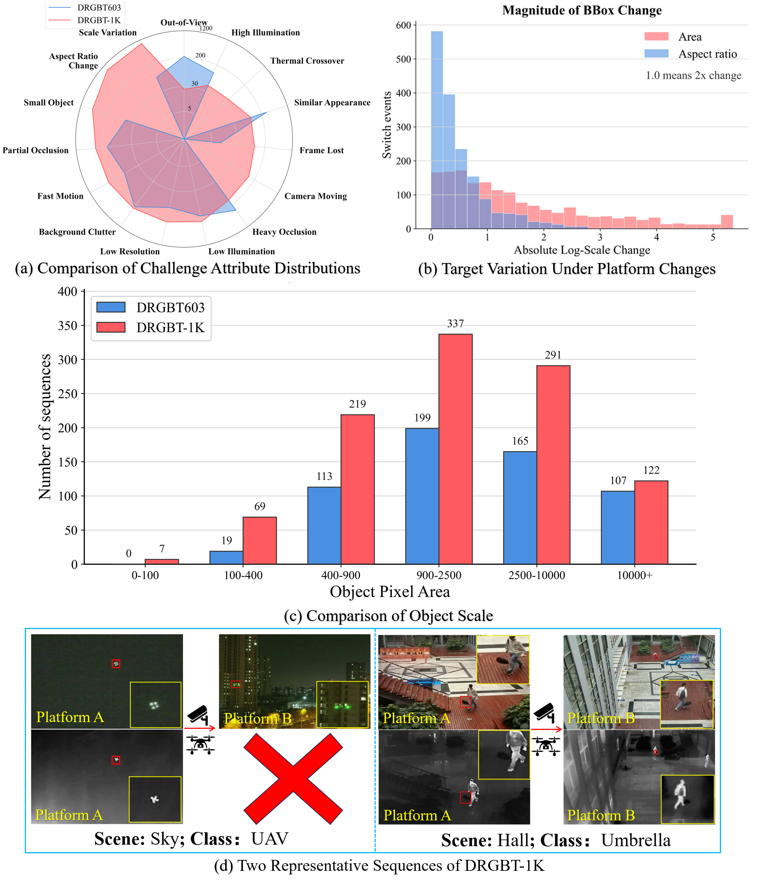
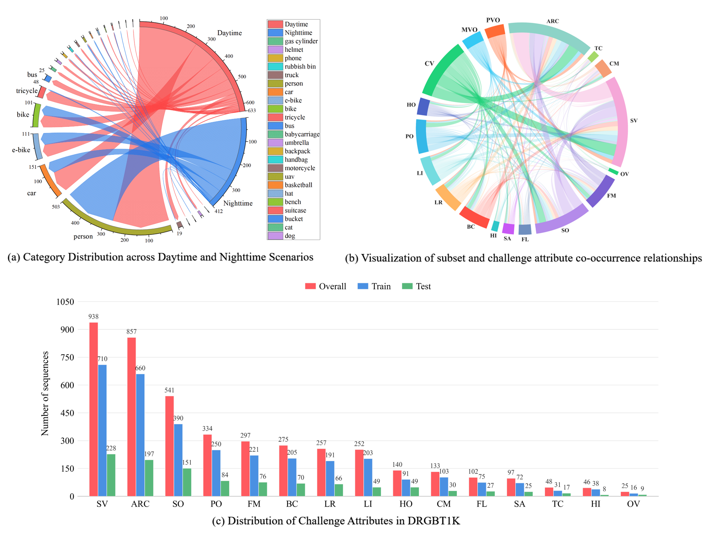
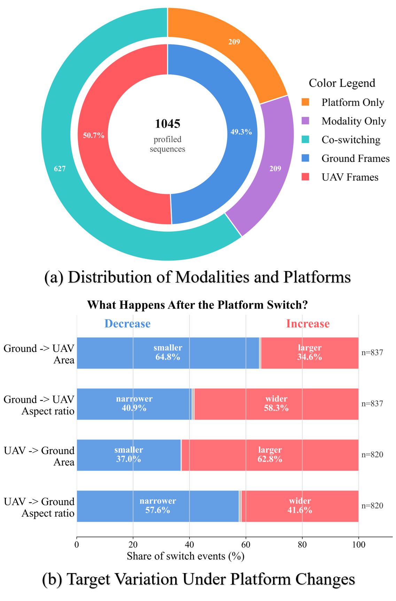
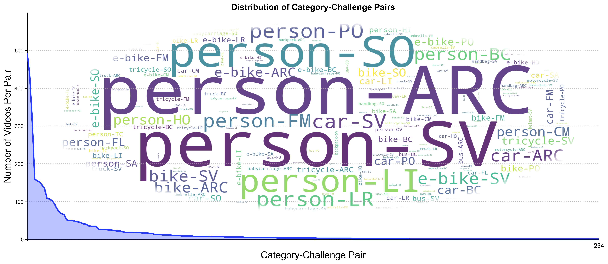
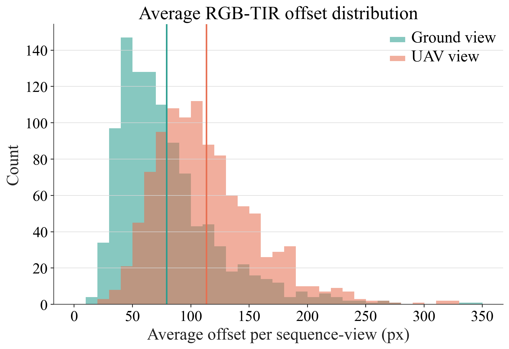

# DRGBT-1K: A Large-scale High-quality Benchmark for Dynamic RGBT Tracking

[](#5-dataset-download)
[](https://www.codabench.org/competitions/17422/#/pages-tab)


**Online Evaluation Platform:**
https://www.codabench.org/competitions/17422/

---
## 1. Motivation

RGBT tracking receives a surge of interest in the computer vision community, but existing RGBT benchmarks assume a single, fixed observation platform with synchronized RGB and thermal sensors. In real-world collaborative perception systems, however, the target is often observed by **multiple heterogeneous platforms** (e.g., UAVs and ground cameras) that carry different sensors and may hand off tracking responsibility over time. This leads to **Dynamic RGBT (DRGBT) tracking**, where both the available modalities and observation viewpoints change dynamically.

The existing DRGBT dataset (DRGBT603) is limited in scale and contains many synthetically constructed cross-platform sequences. To address these limitations, we present **DRGBT-1K** — the first large-scale, fully real-captured DRGBT tracking benchmark.

<p align="center">
  
</p>

---

## 2. About DRGBT-1K Benchmark

### Highlights

* **Fully Real-Captured**: All 1,045 sequences are captured from real-world scenarios using real cross-platform handoffs, avoiding synthetic construction.
* **Large Scale**: Contains **1,045 real sequences** and **795K frame pairs** in total (**2,090** RGBT sequences considering multi-view perspectives).
* **High-Quality Annotations**: Contains over **799K** densely annotated target bounding boxes across multi-view sequences.
* **Multi-Platform Imaging Devices**: Data collected using **DJI Mavic 3T** (UAV) and **Hikvision RGBT Camera** (handheld/ground), preserving genuine viewpoint discontinuities.
* **Rich Scenes and Categories**: Covers **24 target categories** across diverse scenarios (daytime, nighttime, highways, parks, campuses, etc.).
* **Real-World Challenges**: Annotated with **15 challenge attributes** reflecting practical DRGBT tracking difficulties.

### Data Samples

Below are representative samples from DRGBT-1K, showcasing various scenes, categories, and cross-platform viewpoints (RGB and thermal pairs from both UAV and ground perspectives):

<p align="center">
  
</p>

---

## 3. Dataset Statistics

### Comparison with Existing Benchmarks

| Dataset | Pub. Info | Task Type | View Num. | Sequence Num. | Total Frames | Object Classes | Attr. | Dynamic Modality | Cross Platform | Real Cross-platform Seq. Num. | Synthetic Cross-platform Seq. Num. |
| :--- | :---: | :---: | :---: | :---: | :---: | :---: | :---: | :---: | :---: | :---: | :---: |
| **GTOT** | TIP 2017 | RGBT | 1 | 50 | 7.8K | 9 | 7 | ✕ | ✕ | 0 | 0 |
| **RGBT210** | CVPR 2018 | RGBT | 1 | 210 | 104.7K | 22 | 12 | ✕ | ✕ | 0 | 0 |
| **RGBT234** | TPAMI 2019 | RGBT | 1 | 234 | 116.7K | 22 | 12 | ✕ | ✕ | 0 | 0 |
| **LasHeR** | TIP 2021 | RGBT | 1 | 1224 | 734.8K | 32 | 19 | ✕ | ✕ | 0 | 0 |
| **VTUAV** | CVPR 2022 | RGBT | 1 | 500 | 1.7M | 13 | 13 | ✕ | ✕ | 0 | 0 |
| **DRGBT603** | TIP 2026 | DRGBT | 2 | 603 | 1.49M | 29 | 12 | ✓ | ✓ | 203 | 400 |
| **DRGBT-1K (Ours)** | — | DRGBT | 2 | **1045 (2090)†** | **795K** | **24** | **15** | **✓** | **✓** | **1045** | **0** |

†indicates that DRGBT contains 2,090 RGBT tracking sequences in total.

### Distribution Statistics

The following figure shows: (a) Category distribution across daytime and nighttime scenarios, (b) Visualization of subset and challenge attribute co-occurrence relationships, and (c) Distribution of challenge attributes with train/test splits.

<p align="center">
  
</p>

The frame distribution between UAV and ground viewpoints is highly balanced, accounting for **50.7%** and **49.3%** respectively, which significantly reduces viewpoint bias in cross-platform evaluation. In addition, quantitative analysis shows that platform transitions induce severe target scale variations: Ground-to-UAV handoffs result in target area reduction in **64.8%** of cases, while UAV-to-Ground handoffs lead to target area expansion in **62.8%** of cases.

<p align="center">
  
</p>

<p align="center">
  
</p>

### 15 Challenge Attributes

DRGBT-1K annotates each sequence with 15 challenge attributes reflecting real-world tracking scenarios:

| Attr | Full Name | Description |
| :---: | :--- | :--- |
| **HO** | Heavy Occlusion | The target is severely occluded. |
| **PO** | Partial Occlusion | The target is slightly or partially occluded. |
| **LI** | Low Illumination | The sequence is captured under low-light conditions (e.g., nighttime). |
| **LR** | Low Resolution | The target region is blurred or has low visual resolution. |
| **BC** | Background Clutter | The background is complex and contains many interfering objects. |
| **HI** | High Illumination | Strong illumination or glare appears in the scene. |
| **SA** | Similar Appearance | Similar objects appear near the target, making it hard to distinguish. |
| **FL** | Frame Lost | Several consecutive frames are completely identical. |
| **SO** | Small Object | The target is very small in the image. |
| **FM** | Fast Motion | The target moves rapidly between adjacent frames. |
| **OV** | Out-of-View | The target leaves the camera field of view and later reappears. |
| **SV** | Scale Variation | The target undergoes significant scale changes. |
| **CM** | Camera Moving | The camera has obvious motion or shake. |
| **TC** | Thermal Crossover | Target and background have similar temperatures (low thermal contrast). |
| **ARC** | Aspect Ratio Change | The aspect ratio of the bounding box is outside the range [0.5, 2]. |

---

## 4. Train/Test Split

We split DRGBT-1K into **training** and **testing** subsets according to the target category distribution, ensuring balanced representation across all 24 classes:

| Split | Sequences | Usage |
| :---: | :---: | :--- |
| Training | 800 | For training deep DRGBT trackers |
| Testing | 245 | For benchmarking and evaluation |
| **Total** | **1045** | — |

The training and testing sets maintain similar distributions in terms of target categories, challenge attributes, and day/night ratios.

---

## 5. Dataset Download

* **DRGBT-1K (Aligned)**: [BaiduNetdisk](https://pan.baidu.com/s/1JEkNQNG4gr3qckoY65lTDA?pwd=g13h)（Password: g13h）
* **DRGBT-1K (Unaligned)**: [BaiduNetdisk](https://pan.baidu.com/s/1GUuPtvjFX1DpNhIbEi5HkQ?pwd=6xxh)（Password: 6xxh）
  > *Note: Due to the physical structure of heterogeneous devices and sensor mechanisms, real-world data naturally exhibits modality offsets between RGB and TIR under different viewpoints. We provide this unaligned version (where the spatial deviation is constrained within [0.01D, 0.17D] and the initial bias is randomly sampled within [2%, 17%]D, with D being the image diagonal length) to facilitate research on spatial perturbation and cross-modality alignment.*

<p align="center">
  
</p>

---

## 6. Dataset File Structure

```
sequence_name/
├── ground_viewq/
│   ├── RGB/
│   │   ├── 000001.jpg
│   │   └── ...
│   ├── TIR/
│   │   ├── 000001.jpg
│   │   └── ...
│   └── init.txt
├── uav_viewq/
│   ├── RGB/
│   │   ├── 000001.jpg
│   │   └── ...
│   ├── TIR/
│   │   ├── 000001.jpg
│   │   └── ...
│   └── init.txt
├── challenges.txt
├── modality.txt
├── platforms.txt
├── scene_class.txt
├── target_class.txt
```

---

## 7. Benchmark Results

### Evaluation on DRGBT-1K

We evaluate multiple categories of tracking methods on DRGBT-1K, including RGBT trackers, modality-missing RGBT (MMRGBT) trackers, and DRGBT trackers, under the **One-Pass Evaluation (OPE)** protocol. The primary evaluation metrics are:
* **Precision Rate (PR)**: Percentage of frames whose center location error is within 20 pixels.
* **Normalized Precision Rate (NPR)**: Center location error normalized by target size.
* **Success Rate (SR)**: Bounding box overlap (IoU) evaluated using Area Under Curve (AUC).

### Overall Performance on DRGBT-1K

Below are the baseline results of representative state-of-the-art trackers evaluated on the DRGBT-1K test set:

<table>
  <thead>
    <tr>
      <th align="left">Method</th>
      <th align="center">Source</th>
      <th align="center">PR (%)</th>
      <th align="center">NPR (%)</th>
      <th align="center">SR (%)</th>
    </tr>
  </thead>
  <tbody>
    <tr>
      <td colspan="5" align="center"><b><i>RGBT Trackers</i></b></td>
    </tr>
    <tr>
      <td><b>OSTrack</b></td>
      <td align="center">ECCV'22</td>
      <td align="center">47.39</td>
      <td align="center">41.47</td>
      <td align="center">34.46</td>
    </tr>
    <tr>
      <td><b>TBSI</b></td>
      <td align="center">CVPR'23</td>
      <td align="center">43.89</td>
      <td align="center">38.81</td>
      <td align="center">32.34</td>
    </tr>
    <tr>
      <td><b>TATrack</b></td>
      <td align="center">AAAI'24</td>
      <td align="center">47.82</td>
      <td align="center">41.17</td>
      <td align="center">34.40</td>
    </tr>
    <tr>
      <td><b>BAT</b></td>
      <td align="center">AAAI'24</td>
      <td align="center">45.84</td>
      <td align="center">41.08</td>
      <td align="center">33.86</td>
    </tr>
    <tr>
      <td><b>PURA</b></td>
      <td align="center">CVPR'24</td>
      <td align="center">48.32</td>
      <td align="center">40.73</td>
      <td align="center">33.98</td>
    </tr>
    <tr>
      <td><b>SDSTrack</b></td>
      <td align="center">CVPR'24</td>
      <td align="center">40.66</td>
      <td align="center">33.64</td>
      <td align="center">28.23</td>
    </tr>
    <tr>
      <td><b>MMLoRAT</b></td>
      <td align="center">ECCV'24</td>
      <td align="center">47.76</td>
      <td align="center"><b><font color="blue">43.06</font></b></td>
      <td align="center">34.92</td>
    </tr>
    <tr>
      <td><b>CKD</b></td>
      <td align="center">ACM MM'24</td>
      <td align="center">45.67</td>
      <td align="center">40.97</td>
      <td align="center">33.75</td>
    </tr>
    <tr>
      <td><b>AINet</b></td>
      <td align="center">AAAI'25</td>
      <td align="center">44.83</td>
      <td align="center">40.42</td>
      <td align="center">33.14</td>
    </tr>
    <tr>
      <td><b>STTrack</b></td>
      <td align="center">AAAI'25</td>
      <td align="center">22.57</td>
      <td align="center">17.38</td>
      <td align="center">16.61</td>
    </tr>
    <tr>
      <td><b>CAFormer</b></td>
      <td align="center">AAAI'25</td>
      <td align="center">46.06</td>
      <td align="center">39.80</td>
      <td align="center">33.51</td>
    </tr>
    <tr>
      <td><b>FMTrack</b></td>
      <td align="center">TCSVT'25</td>
      <td align="center"><b><font color="blue">48.64</font></b></td>
      <td align="center">41.58</td>
      <td align="center">34.91</td>
    </tr>
    <tr>
      <td><b>QSTNet</b></td>
      <td align="center">TIP'25</td>
      <td align="center">44.21</td>
      <td align="center">39.20</td>
      <td align="center">32.27</td>
    </tr>
    <tr>
      <td><b>MRTTrack</b></td>
      <td align="center">PR'25</td>
      <td align="center">43.72</td>
      <td align="center">38.76</td>
      <td align="center">32.04</td>
    </tr>
    <tr>
      <td><b>UATrack</b></td>
      <td align="center">IJCV'26</td>
      <td align="center">46.92</td>
      <td align="center">40.77</td>
      <td align="center">34.02</td>
    </tr>
    <tr>
      <td><b>GOLA</b></td>
      <td align="center">CVPR'26</td>
      <td align="center"><b><font color="red">51.18</font></b></td>
      <td align="center"><b><font color="red">46.42</font></b></td>
      <td align="center"><b><font color="red">38.01</font></b></td>
    </tr>
    <tr>
      <td colspan="5" align="center"><b><i>MMRGBT Trackers</i></b></td>
    </tr>
    <tr>
      <td><b>IPT</b></td>
      <td align="center">IJCV'25</td>
      <td align="center">46.52</td>
      <td align="center">39.89</td>
      <td align="center">33.46</td>
    </tr>
    <tr>
      <td><b>TMKD</b></td>
      <td align="center">PR'26</td>
      <td align="center">48.06</td>
      <td align="center">42.95</td>
      <td align="center"><b><font color="blue">35.52</font></b></td>
    </tr>
    <tr>
      <td><b>SCDT</b></td>
      <td align="center">CVPR'26</td>
      <td align="center">45.57</td>
      <td align="center">36.41</td>
      <td align="center">29.91</td>
    </tr>
    <tr>
      <td colspan="5" align="center"><b><i>DRGBT Trackers</i></b></td>
    </tr>
    <tr>
      <td><b>CMRL</b></td>
      <td align="center">TIP'26</td>
      <td align="center">43.03</td>
      <td align="center">38.48</td>
      <td align="center">31.82</td>
    </tr>
  </tbody>
</table>


### Attribute- and Subset-based Performance

To analyze tracker performance under various scenarios, we evaluate the trackers across 15 challenge attributes and 3 variation subsets: **Modality Variation Only (MVO, 209 sequences)**, **Platform Variation Only (PVO, 209 sequences)**, and **Combined Variation (CV, 627 sequences)**.

Each cell reports **PR/SR (%)**. The best and second-best results under each row are highlighted in **red** and **blue** font, respectively. Based on the attribute- and subset-specific evaluation, we can observe that:
* The dedicated DRGBT tracker **CMRL** achieves outstanding performance on the platform transition subsets (**PVO** and **CV**), demonstrating its robustness in handling viewpoint and platform switches. It also exhibits superior robustness under degradation-related attributes, achieving the best PR and SR scores under **LR**, **HI**, **FL**, **OV**, and **CM**.
* **GOLA** achieves the best success rates (SR) across the largest number of individual challenge attributes (including PO, LI, SO, FM, SV, and ARC) and the **MVO** subset, reflecting its strong generalization in handling diverse challenge factors and dynamic modality variations.
* Other trackers also show distinct strengths: **TATrack** achieves the highest Precision Rate (PR) under **BC**, **SO**, **SV**, and **ARC**, while the modality-missing tracker **TMKD** performs competitively under **SA** (similar appearance) and **TC** (thermal crossover).

<h4>Attribute- and Subset-based Performance on DRGBT-1K Test Set (Part 1)</h4>
<table>
  <thead>
    <tr>
      <th align="center">Attr</th>
      <th align="center">OSTrack</th>
      <th align="center">TBSI</th>
      <th align="center">TATrack</th>
      <th align="center">BAT</th>
      <th align="center">PURA</th>
      <th align="center">SDSTrack</th>
      <th align="center">MMLoRAT</th>
      <th align="center">CKD</th>
      <th align="center">AINet</th>
      <th align="center">STTrack</th>
    </tr>
  </thead>
  <tbody>
    <tr>
      <td align="center"><b>HO</b></td>
      <td align="center"><b><font color="red">47.97</font></b>/<b><font color="blue">34.64</font></b></td>
      <td align="center">39.38/30.55</td>
      <td align="center"><b><font color="blue">47.41</font></b>/34.02</td>
      <td align="center">42.73/32.60</td>
      <td align="center">44.72/31.56</td>
      <td align="center">33.00/25.14</td>
      <td align="center">42.33/30.90</td>
      <td align="center">43.36/32.80</td>
      <td align="center">39.42/31.08</td>
      <td align="center">13.41/8.73</td>
    </tr>
    <tr>
      <td align="center"><b>PO</b></td>
      <td align="center">39.01/32.05</td>
      <td align="center">36.61/30.00</td>
      <td align="center">39.05/31.84</td>
      <td align="center">36.74/30.64</td>
      <td align="center">36.63/29.95</td>
      <td align="center">32.79/26.40</td>
      <td align="center">38.22/30.60</td>
      <td align="center">37.05/30.55</td>
      <td align="center">36.26/30.08</td>
      <td align="center">7.79/8.62</td>
    </tr>
    <tr>
      <td align="center"><b>LI</b></td>
      <td align="center">34.72/29.56</td>
      <td align="center">35.62/30.07</td>
      <td align="center"><b><font color="blue">38.13</font></b>/30.91</td>
      <td align="center"><b><font color="red">38.17</font></b>/<b><font color="blue">31.16</font></b></td>
      <td align="center">36.47/30.00</td>
      <td align="center">30.13/23.84</td>
      <td align="center">36.20/30.34</td>
      <td align="center">35.11/29.83</td>
      <td align="center">34.95/29.72</td>
      <td align="center">9.97/7.94</td>
    </tr>
    <tr>
      <td align="center"><b>LR</b></td>
      <td align="center">36.17/27.70</td>
      <td align="center">33.56/26.44</td>
      <td align="center">36.93/28.40</td>
      <td align="center">36.06/28.27</td>
      <td align="center">35.57/26.41</td>
      <td align="center">31.23/23.65</td>
      <td align="center">34.85/27.55</td>
      <td align="center">34.17/27.46</td>
      <td align="center">33.59/27.13</td>
      <td align="center">13.49/8.01</td>
    </tr>
    <tr>
      <td align="center"><b>BC</b></td>
      <td align="center"><b><font color="blue">44.04</font></b>/33.73</td>
      <td align="center">35.94/29.49</td>
      <td align="center"><b><font color="red">44.82</font></b>/<b><font color="red">34.68</font></b></td>
      <td align="center">41.37/32.57</td>
      <td align="center">40.97/30.47</td>
      <td align="center">33.12/26.03</td>
      <td align="center">38.66/30.40</td>
      <td align="center">39.56/31.82</td>
      <td align="center">36.25/30.04</td>
      <td align="center">15.47/9.37</td>
    </tr>
    <tr>
      <td align="center"><b>HI</b></td>
      <td align="center">33.41/24.90</td>
      <td align="center">31.51/22.72</td>
      <td align="center">28.56/22.22</td>
      <td align="center">29.78/20.53</td>
      <td align="center">24.43/18.97</td>
      <td align="center">25.61/17.75</td>
      <td align="center">24.14/18.17</td>
      <td align="center">34.72/24.54</td>
      <td align="center">26.51/20.06</td>
      <td align="center">4.46/6.08</td>
    </tr>
    <tr>
      <td align="center"><b>SA</b></td>
      <td align="center">40.91/<b><font color="blue">32.99</font></b></td>
      <td align="center">37.60/30.84</td>
      <td align="center">39.85/31.74</td>
      <td align="center">40.47/32.64</td>
      <td align="center">38.92/29.38</td>
      <td align="center">29.22/23.85</td>
      <td align="center">37.54/29.63</td>
      <td align="center">37.97/31.33</td>
      <td align="center">35.31/30.12</td>
      <td align="center">12.25/9.16</td>
    </tr>
    <tr>
      <td align="center"><b>FL</b></td>
      <td align="center">35.82/25.15</td>
      <td align="center">34.22/24.77</td>
      <td align="center">36.98/<b><font color="blue">26.96</font></b></td>
      <td align="center">34.56/24.87</td>
      <td align="center">32.62/22.86</td>
      <td align="center">27.21/20.44</td>
      <td align="center">34.55/24.96</td>
      <td align="center">34.05/25.05</td>
      <td align="center">32.17/23.76</td>
      <td align="center">6.69/6.55</td>
    </tr>
    <tr>
      <td align="center"><b>SO</b></td>
      <td align="center">41.10/30.99</td>
      <td align="center">36.97/28.83</td>
      <td align="center"><b><font color="red">42.33</font></b>/<b><font color="blue">31.75</font></b></td>
      <td align="center">38.21/29.49</td>
      <td align="center">38.40/27.96</td>
      <td align="center">32.29/24.31</td>
      <td align="center">38.84/29.13</td>
      <td align="center">38.22/29.53</td>
      <td align="center">35.90/28.35</td>
      <td align="center">14.88/8.41</td>
    </tr>
    <tr>
      <td align="center"><b>FM</b></td>
      <td align="center">38.39/32.59</td>
      <td align="center">37.32/32.06</td>
      <td align="center">39.95/33.64</td>
      <td align="center">40.33/34.22</td>
      <td align="center">38.17/31.84</td>
      <td align="center">31.42/26.67</td>
      <td align="center">36.70/31.83</td>
      <td align="center">37.27/32.24</td>
      <td align="center">36.05/31.54</td>
      <td align="center">5.79/9.19</td>
    </tr>
    <tr>
      <td align="center"><b>OV</b></td>
      <td align="center">16.78/15.26</td>
      <td align="center">14.25/13.48</td>
      <td align="center">16.06/14.45</td>
      <td align="center">17.90/14.61</td>
      <td align="center"><b><font color="blue">18.90</font></b>/<b><font color="blue">15.78</font></b></td>
      <td align="center">12.41/11.62</td>
      <td align="center">16.76/14.98</td>
      <td align="center">16.81/14.24</td>
      <td align="center">15.40/13.80</td>
      <td align="center">7.27/7.05</td>
    </tr>
    <tr>
      <td align="center"><b>SV</b></td>
      <td align="center">40.48/32.36</td>
      <td align="center">36.97/30.34</td>
      <td align="center"><b><font color="red">41.62</font></b>/<b><font color="blue">33.22</font></b></td>
      <td align="center">39.21/31.78</td>
      <td align="center">39.22/30.43</td>
      <td align="center">32.83/26.18</td>
      <td align="center">38.74/30.94</td>
      <td align="center">38.10/31.27</td>
      <td align="center">36.69/30.32</td>
      <td align="center">11.54/8.79</td>
    </tr>
    <tr>
      <td align="center"><b>CM</b></td>
      <td align="center">41.00/34.23</td>
      <td align="center">38.34/33.05</td>
      <td align="center">42.60/35.59</td>
      <td align="center"><b><font color="blue">44.45</font></b>/<b><font color="blue">36.67</font></b></td>
      <td align="center">39.91/31.59</td>
      <td align="center">35.05/28.75</td>
      <td align="center">37.16/31.96</td>
      <td align="center">40.46/34.05</td>
      <td align="center">40.62/34.15</td>
      <td align="center">6.10/9.42</td>
    </tr>
    <tr>
      <td align="center"><b>TC</b></td>
      <td align="center">25.77/21.71</td>
      <td align="center">24.86/20.57</td>
      <td align="center">27.99/22.06</td>
      <td align="center">25.22/20.94</td>
      <td align="center">29.84/22.53</td>
      <td align="center">19.93/15.83</td>
      <td align="center">31.42/23.87</td>
      <td align="center">26.77/22.23</td>
      <td align="center">23.78/19.91</td>
      <td align="center">4.50/7.26</td>
    </tr>
    <tr>
      <td align="center"><b>ARC</b></td>
      <td align="center">39.49/31.77</td>
      <td align="center">35.95/29.81</td>
      <td align="center"><b><font color="red">41.19</font></b>/<b><font color="blue">32.96</font></b></td>
      <td align="center">37.74/30.94</td>
      <td align="center">38.07/29.83</td>
      <td align="center">32.04/25.62</td>
      <td align="center">37.79/30.37</td>
      <td align="center">37.11/30.62</td>
      <td align="center">35.80/29.73</td>
      <td align="center">11.09/8.56</td>
    </tr>
    <tr>
      <td align="center"><b>MVO</b></td>
      <td align="center">77.25/54.24</td>
      <td align="center">65.01/48.22</td>
      <td align="center"><b><font color="red">78.72</font></b>/<b><font color="blue">56.21</font></b></td>
      <td align="center">69.83/52.08</td>
      <td align="center">70.42/49.35</td>
      <td align="center">51.20/36.79</td>
      <td align="center">69.09/50.30</td>
      <td align="center">69.34/51.29</td>
      <td align="center">64.67/48.24</td>
      <td align="center">21.01/11.41</td>
    </tr>
    <tr>
      <td align="center"><b>PVO</b></td>
      <td align="center">35.12/30.14</td>
      <td align="center">35.71/30.29</td>
      <td align="center">36.97/30.67</td>
      <td align="center">37.02/31.09</td>
      <td align="center">37.74/29.91</td>
      <td align="center">35.24/27.70</td>
      <td align="center">35.81/30.06</td>
      <td align="center">36.11/30.86</td>
      <td align="center">35.53/30.64</td>
      <td align="center">11.11/8.46</td>
    </tr>
    <tr>
      <td align="center"><b>CV</b></td>
      <td align="center">30.19/25.36</td>
      <td align="center">28.32/24.18</td>
      <td align="center">30.92/25.76</td>
      <td align="center">29.55/24.65</td>
      <td align="center">29.75/24.18</td>
      <td align="center">26.34/21.86</td>
      <td align="center">29.89/24.55</td>
      <td align="center">28.72/24.42</td>
      <td align="center">28.20/24.12</td>
      <td align="center">8.92/8.00</td>
    </tr>
  </tbody>
</table>

<h4>Attribute- and Subset-based Performance on DRGBT-1K Test Set (Part 2)</h4>
<table>
  <thead>
    <tr>
      <th align="center">Attr</th>
      <th align="center">CAFormer</th>
      <th align="center">IPT</th>
      <th align="center">FMTrack</th>
      <th align="center">QSTNet</th>
      <th align="center">UATrack</th>
      <th align="center">CMRL</th>
      <th align="center">MRTTrack</th>
      <th align="center">TMKD</th>
      <th align="center">SCDT</th>
      <th align="center">GOLA</th>
    </tr>
  </thead>
  <tbody>
    <tr>
      <td align="center"><b>HO</b></td>
      <td align="center">39.64/30.46</td>
      <td align="center">37.03/27.82</td>
      <td align="center">40.95/30.98</td>
      <td align="center">38.79/29.71</td>
      <td align="center">46.84/33.91</td>
      <td align="center">46.71/34.56</td>
      <td align="center">40.02/30.04</td>
      <td align="center">46.10/<b><font color="red">34.83</font></b></td>
      <td align="center">24.74/18.14</td>
      <td align="center">45.30/34.15</td>
    </tr>
    <tr>
      <td align="center"><b>PO</b></td>
      <td align="center">37.34/30.13</td>
      <td align="center">33.87/28.05</td>
      <td align="center">38.15/29.81</td>
      <td align="center">35.90/29.51</td>
      <td align="center">39.58/31.95</td>
      <td align="center"><b><font color="blue">41.13</font></b>/<b><font color="blue">33.82</font></b></td>
      <td align="center">34.26/28.69</td>
      <td align="center">38.99/32.07</td>
      <td align="center">29.53/21.35</td>
      <td align="center"><b><font color="red">41.70</font></b>/<b><font color="red">33.91</font></b></td>
    </tr>
    <tr>
      <td align="center"><b>LI</b></td>
      <td align="center">36.47/30.22</td>
      <td align="center">34.38/29.14</td>
      <td align="center">36.53/29.74</td>
      <td align="center">34.23/28.89</td>
      <td align="center">37.26/30.29</td>
      <td align="center">36.65/30.29</td>
      <td align="center">35.38/29.39</td>
      <td align="center">35.74/30.30</td>
      <td align="center">28.76/22.87</td>
      <td align="center">37.43/<b><font color="red">31.35</font></b></td>
    </tr>
    <tr>
      <td align="center"><b>LR</b></td>
      <td align="center">35.92/27.62</td>
      <td align="center">34.71/26.32</td>
      <td align="center">35.87/27.14</td>
      <td align="center">33.63/26.58</td>
      <td align="center">37.42/28.31</td>
      <td align="center"><b><font color="red">37.91</font></b>/<b><font color="red">29.46</font></b></td>
      <td align="center">35.04/27.48</td>
      <td align="center">36.42/28.17</td>
      <td align="center">30.45/20.74</td>
      <td align="center"><b><font color="blue">37.55</font></b>/<b><font color="blue">29.26</font></b></td>
    </tr>
    <tr>
      <td align="center"><b>BC</b></td>
      <td align="center">38.08/30.92</td>
      <td align="center">38.84/29.55</td>
      <td align="center">40.19/30.93</td>
      <td align="center">37.44/29.75</td>
      <td align="center">41.19/31.84</td>
      <td align="center">40.55/32.14</td>
      <td align="center">37.87/30.57</td>
      <td align="center">43.53/<b><font color="blue">33.86</font></b></td>
      <td align="center">27.17/20.17</td>
      <td align="center">43.34/33.81</td>
    </tr>
    <tr>
      <td align="center"><b>HI</b></td>
      <td align="center">31.63/22.51</td>
      <td align="center">34.30/22.52</td>
      <td align="center"><b><font color="blue">35.40</font></b>/<b><font color="blue">25.85</font></b></td>
      <td align="center">33.63/23.42</td>
      <td align="center">32.41/23.42</td>
      <td align="center"><b><font color="red">40.43</font></b>/<b><font color="red">31.01</font></b></td>
      <td align="center">20.96/17.41</td>
      <td align="center">32.18/22.64</td>
      <td align="center">31.30/19.26</td>
      <td align="center">26.71/20.72</td>
    </tr>
    <tr>
      <td align="center"><b>SA</b></td>
      <td align="center">37.95/30.81</td>
      <td align="center">40.22/31.04</td>
      <td align="center">36.90/30.43</td>
      <td align="center">39.57/30.78</td>
      <td align="center"><b><font color="blue">41.40</font></b>/32.49</td>
      <td align="center">36.83/30.74</td>
      <td align="center">40.82/31.47</td>
      <td align="center"><b><font color="red">41.67</font></b>/<b><font color="red">33.64</font></b></td>
      <td align="center">29.55/22.39</td>
      <td align="center">36.81/31.07</td>
    </tr>
    <tr>
      <td align="center"><b>FL</b></td>
      <td align="center">35.34/25.39</td>
      <td align="center">28.99/21.41</td>
      <td align="center">35.52/24.97</td>
      <td align="center">33.36/24.01</td>
      <td align="center"><b><font color="blue">37.15</font></b>/26.70</td>
      <td align="center"><b><font color="red">39.47</font></b>/<b><font color="red">28.73</font></b></td>
      <td align="center">31.51/22.73</td>
      <td align="center">36.51/25.99</td>
      <td align="center">30.61/18.59</td>
      <td align="center">35.61/26.25</td>
    </tr>
    <tr>
      <td align="center"><b>SO</b></td>
      <td align="center">38.37/29.43</td>
      <td align="center">36.60/27.32</td>
      <td align="center">38.82/28.98</td>
      <td align="center">37.84/29.13</td>
      <td align="center"><b><font color="blue">41.59</font></b>/31.01</td>
      <td align="center">39.39/30.45</td>
      <td align="center">35.63/27.80</td>
      <td align="center">40.85/31.16</td>
      <td align="center">29.89/21.52</td>
      <td align="center">41.52/<b><font color="red">31.80</font></b></td>
    </tr>
    <tr>
      <td align="center"><b>FM</b></td>
      <td align="center">38.72/33.09</td>
      <td align="center">36.14/30.94</td>
      <td align="center">38.01/31.43</td>
      <td align="center">36.28/31.14</td>
      <td align="center">40.59/33.90</td>
      <td align="center"><b><font color="red">41.52</font></b>/<b><font color="blue">34.91</font></b></td>
      <td align="center">36.34/31.38</td>
      <td align="center">39.82/34.01</td>
      <td align="center">28.70/23.30</td>
      <td align="center"><b><font color="blue">40.90</font></b>/<b><font color="red">35.13</font></b></td>
    </tr>
    <tr>
      <td align="center"><b>OV</b></td>
      <td align="center">15.28/13.49</td>
      <td align="center">15.94/13.79</td>
      <td align="center">16.79/13.27</td>
      <td align="center">15.50/13.06</td>
      <td align="center">17.21/13.87</td>
      <td align="center"><b><font color="red">25.47</font></b>/<b><font color="red">19.35</font></b></td>
      <td align="center">14.70/13.86</td>
      <td align="center">16.79/14.90</td>
      <td align="center">12.48/10.71</td>
      <td align="center">17.55/15.29</td>
    </tr>
    <tr>
      <td align="center"><b>SV</b></td>
      <td align="center">38.06/30.82</td>
      <td align="center">37.70/29.65</td>
      <td align="center">38.88/30.53</td>
      <td align="center">37.22/30.21</td>
      <td align="center">40.37/32.02</td>
      <td align="center">41.31/<b><font color="red">33.46</font></b></td>
      <td align="center">35.97/29.58</td>
      <td align="center">40.73/32.72</td>
      <td align="center">30.46/22.71</td>
      <td align="center"><b><font color="blue">41.48</font></b>/<b><font color="red">33.46</font></b></td>
    </tr>
    <tr>
      <td align="center"><b>CM</b></td>
      <td align="center">41.25/34.92</td>
      <td align="center">41.23/32.33</td>
      <td align="center">37.28/31.52</td>
      <td align="center">39.37/32.69</td>
      <td align="center">40.44/33.74</td>
      <td align="center"><b><font color="red">46.91</font></b>/<b><font color="red">39.21</font></b></td>
      <td align="center">37.85/32.15</td>
      <td align="center">44.13/36.00</td>
      <td align="center">28.82/23.45</td>
      <td align="center">42.43/35.60</td>
    </tr>
    <tr>
      <td align="center"><b>TC</b></td>
      <td align="center">25.78/21.94</td>
      <td align="center">26.43/20.71</td>
      <td align="center"><b><font color="blue">33.30</font></b>/22.69</td>
      <td align="center">25.35/20.62</td>
      <td align="center">28.29/22.38</td>
      <td align="center">22.14/19.00</td>
      <td align="center">25.56/21.20</td>
      <td align="center"><b><font color="red">37.19</font></b>/<b><font color="red">26.58</font></b></td>
      <td align="center">22.13/17.01</td>
      <td align="center">30.06/<b><font color="blue">24.62</font></b></td>
    </tr>
    <tr>
      <td align="center"><b>ARC</b></td>
      <td align="center">36.92/30.08</td>
      <td align="center">36.58/29.05</td>
      <td align="center">37.71/30.09</td>
      <td align="center">36.48/29.83</td>
      <td align="center">39.47/31.49</td>
      <td align="center">40.64/32.93</td>
      <td align="center">34.65/28.82</td>
      <td align="center">39.80/32.30</td>
      <td align="center">29.44/22.18</td>
      <td align="center"><b><font color="blue">40.68</font></b>/<b><font color="red">33.12</font></b></td>
    </tr>
    <tr>
      <td align="center"><b>MVO</b></td>
      <td align="center">66.82/49.39</td>
      <td align="center">61.21/45.12</td>
      <td align="center">66.99/48.60</td>
      <td align="center">62.90/46.87</td>
      <td align="center">75.12/53.85</td>
      <td align="center">61.07/44.87</td>
      <td align="center">62.22/46.37</td>
      <td align="center">74.29/54.80</td>
      <td align="center">44.56/32.22</td>
      <td align="center"><b><font color="blue">77.61</font></b>/<b><font color="red">57.24</font></b></td>
    </tr>
    <tr>
      <td align="center"><b>PVO</b></td>
      <td align="center">37.01/30.91</td>
      <td align="center">37.08/28.90</td>
      <td align="center">36.71/29.86</td>
      <td align="center">35.60/30.38</td>
      <td align="center">35.76/30.15</td>
      <td align="center"><b><font color="red">42.90</font></b>/<b><font color="red">35.96</font></b></td>
      <td align="center">35.61/29.91</td>
      <td align="center"><b><font color="blue">37.91</font></b>/<b><font color="blue">31.40</font></b></td>
      <td align="center">35.87/28.29</td>
      <td align="center">36.25/30.93</td>
    </tr>
    <tr>
      <td align="center"><b>CV</b></td>
      <td align="center">29.35/24.51</td>
      <td align="center">29.90/24.25</td>
      <td align="center">30.48/24.40</td>
      <td align="center">29.43/24.42</td>
      <td align="center">30.63/25.13</td>
      <td align="center"><b><font color="red">34.61</font></b>/<b><font color="red">28.46</font></b></td>
      <td align="center">28.05/23.88</td>
      <td align="center">30.52/25.42</td>
      <td align="center">23.15/16.70</td>
      <td align="center"><b><font color="blue">31.45</font></b>/<b><font color="blue">26.12</font></b></td>
    </tr>
  </tbody>
</table>


### Qualitative Results

<p align="center">
  
</p>

---

## 8. UGVT-1K: UAV-Ground Collaborative Visual Tracking Benchmark

As a derivative of DRGBT-1K, we also release **UGVT-1K** — a UAV-Ground collaborative RGB-only tracking benchmark. UGVT-1K contains the same cross-platform sequences (split into **800 sequences for training and 245 for testing**) but uses only the visible (RGB) modality, enabling research on multi-view visual tracking without thermal data.

<p align="center">
  
</p>


## License

This dataset is released under the [Creative Commons Attribution-ShareAlike 4.0 International License (CC BY-SA 4.0)](https://creativecommons.org/licenses/by-sa/4.0/).


<!--
---

## 9. Citation

If you find our benchmark, toolkit, or paper helpful in your research, please cite us:

```bibtex
@article{DRGBT-1K2026,
  title={Toward a Large-scale and High-quality Benchmark for DRGBT Tracking},
  author={First Author and Second Author and Third Author},
  journal={arXiv preprint arXiv:xxxx.xxxx},
  year={2026}
}
```

---
--!>
